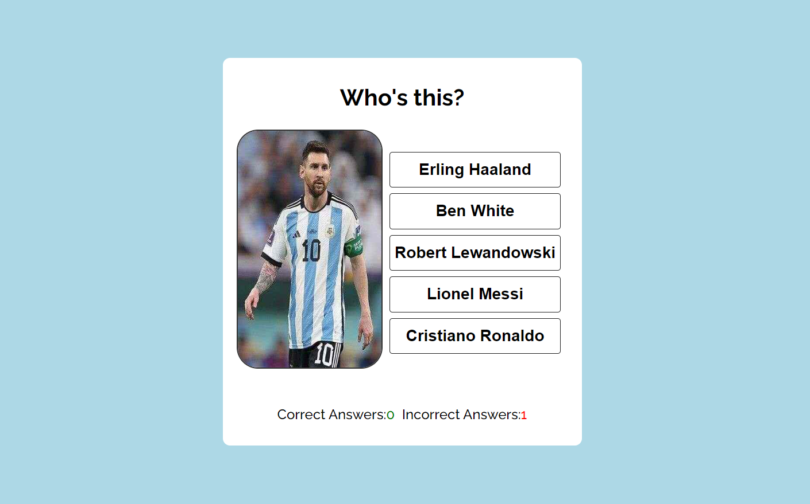
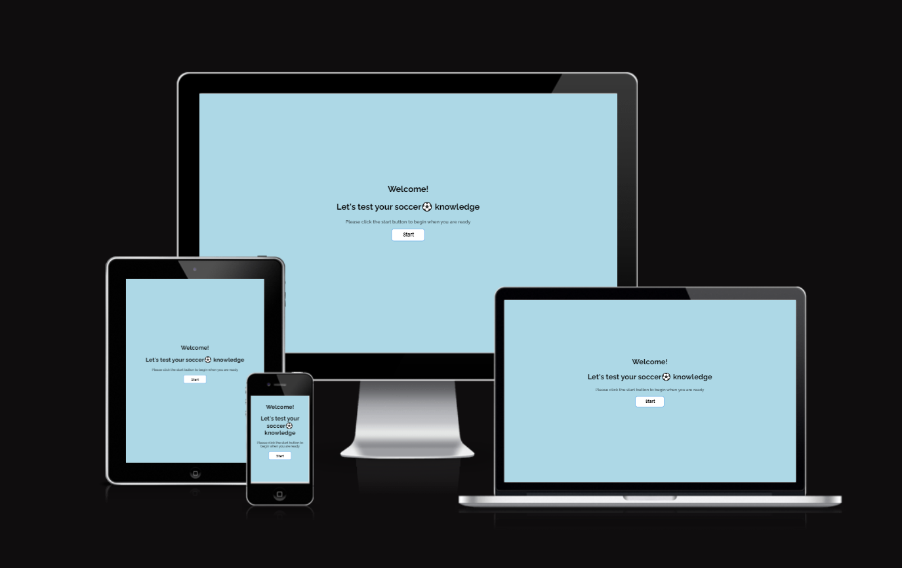

<h1>Soccer⚽ Quiz Game</h1>

 

The Soccer Quiz Game is an online game app for football lovers irrespective of age. It aims at entertaining and testing soccer lovers' knowledge of the identity of some of the game's most decorated players.

 

<h3>User</h3>

<ul>
<li>As a user, i want to be able to find a soccer game online for entertainment purposes.</li>
<li>As a user, i want to be able to test my knowledge of football players while also being entertained.</li>
<li>As a user, i want to be able to know the right answer when i fail a question.</li>
<li>As a user, i want to be able to access the game at any time of the day.</li>
</ul>

<h3>Game Developer</h3>
<ul>
<li>As the game developer, i want to be able to create a soccer quiz game every football lover can enjoy irrespective of age.</li>
<li>As the game developer, i want to be able to welcome users to my game app and give them to opportunity to begin when they are ready.</li>
<li>As the game developer, i want to be able to test football lovers' knowledge of some of their favorite players.</li>
<li>As the game developer, i want to be able to provide players, answer options to select the right answer from.</li>
<li>As the game developer, i want to be able to immediately notify players of their correctly and incorrectly picked answers.</li>
<li>As the game developer, i want to be able to enable players instantly see their correct and incorrect game scores as they play.</li>
<li>As the game developer, i want to be able to enable players reset and restart the game after 5 plays.</li>
</ul>
 

 

<h2>Features</h2>

In achieving the user and app developer goals, i have created a two-paged picture/name pairing quiz game that requires players to identify a randomly generated player's image by name from five(5) provided name options while also using the feedback and scoring features to enhance users' experience. Upon visiting the app, users are greeted and invited to begin playing when they are ready via the welcome page. Upon clicking the start button, users are taken to the game page to begin playing.

 

<h4>The Welcome Page</h4>
<ul>
<li>This is the first page visitors of the app encounter. The page welcomes players to the app and informs them what the game is about.</li>
</ul>

<h4>The Start Button</h4>
<ul>
<li>A start button is provided on the welcome page that allows gives visitors access to the the game page to play the game.</li>
</ul>

<h4>The Game Page</h4>
<ul>
<li>This page contains the game itself. Visitors/players can play the game directly on this page.</li>
</ul>

<h4>The Feedback Feature</h4>
<ul>
<li>The feedback feature is otherwise identified also as the message feature. The idea behind including this feature is to notify players in real time of whether a selected answer is right or wrong.</li>
</ul>
<ul>
<li>Where a selected answer is right, a green-colored - "Congrats! Answer is Correct." - alert pops up and where the selected answer is wrong, a red-colored - "Incorrect! The answer was ${correctAnswer}" - pops up.</li>
</ul>

<h4>The Scoring Feature</h4>
<ul>
<li>The idea behind including the scoring tracker feature is to keep track in real time of the number of players' won and lost plays. While the "correct" counter keeps track of number of correct answers scored by players, the "incorrect" counter tracks the number of players' wrong answers.</li>
</ul>
 

<h3>Technology Used</h3>

<strong>Html</strong>

<ul>
<li>I used this technology to structure my webpages.</li>
</ul>

<strong>CSS</strong>

<ul>
<li>I used this technology to style and add layouts to my project.</li>
</ul>

<strong>JavaScript</strong>

<ul>
<li>I used this technology to add interactivity to this project.</li>
</ul>

<strong>GoogleFonts</strong>

<ul>
<li>I used this techology for all the fonts used in this project.</li>
</ul>

<strong>Hubspot</strong>

<ul>
<li>I used this technology to create my favicon logo.</li>
</ul>

<strong>jpeg-optimizer.com</strong>

<ul>
<li>I used this technology to optimize the images i used in this project.</li>
</ul>
 

<h3>Testing</h3>

I manually tested this project to determine site usability, responsiveness and intuitivity to new users, by self and with the help of a few friends.

 

<h4>Testing phase</h4>
 
<h5>Testing the start and option buttons</h5>
<table>
<tr>
    <th>Test</th>
    <th>Outcome</th>
  </tr>
   <tr>
    <td>Start button leads to the game page.</td>
    <td>Pass</td>
  </tr>
  <tr>
    <td>Option buttons increments correct and incorrect scores and also lead to the next question</td>
    <td>Pass</td>
  </tr>
</table>
 

<h5>Testing for responsiveness</h5>
<table>
<tr>
    <th>Test</th>
    <th>Outcome</th>
  </tr>
   <tr>
    <td>Welcome and game pages display correctly on screens larger than 950px</td>
    <td>Pass</td>
  </tr>
  <tr>
    <td>Welcome and game pages display correctly on screens smaller than 950px</td>
    <td>Pass</td>
  </tr>
</table>
 

<h4>User testing</h4>
 
<h5>User testing challenge</h5>

5 users were tasked prior to visiting the web page to conduct under-stated basic testing and report on success or otherwise.

 
<table>
<tr>
    <th>Test</th>
    <th>Result</th>
  </tr>
   <tr>
    <td>Upon arrival to website please navigate to where you would expect to find a contact form</td>
    <td>100%</td>
  </tr>
  <tr>
    <td>Please navigate to the social media links of this business</td>
    <td>100%</td>
  </tr>
  <tr>
    <td>Please fill in contact form with your information and car category preference throught the reserve button</td>
    <td>100%</td>
  </tr>
  <tr>
    <td>Please navigate to the Portfolio page and count how many images there are</td>
    <td>100%</td>
  </tr>
</table>
 

<h5>User responsive testing</h5>

5 users were asked to view the website on their mobile devices and/or tablets to provide any feedback on errors or page overlapping issues.

 
<table>
<tr>
    <th>Test</th>
    <th>Result</th>
  </tr>
   <tr>
    <td>Issues reported</td>
    <td>None</td>
  </tr>
</table>
 

<h3>Bugs</h3>

Solved bugs

<ul>
<li>After deployment, my logo won't stop wrapping on mobile screens of width of 315px and below. I created a new media query for screens of max-width 315px and below to debug the problem</li>
<li>Navbar items kept wrapping on tablet screens even after i reduced it's font size. I debuged it using the code - whitespace : nowrap; - on the media query of tablets</li>
<li>Reserve forms could be submitted with no values using the space key. I debuged the issue using the code - pattern="[A-Za-z0-9]{1,20}"</li>
</ul>
 

<h3>Validator Testing</h3>
<ul>
<li>
HTML

<ul>
<li>The W3C validator-detected errors were corrected.</li>
<li>No errors were returned when re-ran on W3C validator after correction was effected.</li>
</ul>
</li>

<li>
CSS

<ul>
<li>No errors were returned when css style sheet was run on the official (Jigsaw) validator.</li>
</ul>
</li>

<li>
Accessibility

<ul>
<li>I confirmed that the colors and fonts chosen are easy to read and accessible by running it through lighhouse in devtools.</li>

</ul>
</li>

</ul>
 

<h3>Unfixed Bugs</h3>

No unfixed bugs

 

<h3>Deployment</h3>

The site was deployed to GitHub pages using the following steps:

<ul>
<li>Go to the settings tab of GitHub repository page</li>
<li>On the left-hand sidebar in the code and automation section, select pages</li>
<li>Set 'Source' to 'Deploy from Branch', select 'Main branch', set 'Folder' to 'Root', then click save</li>
<li>Click the 'Code<>' tab and wait a few minutes and then refresh repository</li>
<li>Go to the 'Environments' section on the right-hand side and click on 'github-pages'</li>
<li>Click on the URL displayed to see the live deployed site</li>
</ul>

The live link can be found here - https://sirjay009.github.io/Sirjays-Car-Rentals/index.html

 
<h3>Credits</h3>

Credit

<ul>
<li>The favicon link code was taken from https://www.w3schools.com</li>
<li>The navbar link code was taken from the CI love Running Project - https://sirjay009.github.io/love-running/</li>
<li>The code to debug navbar items that kept wrapping on tablet screen was taken from https://css-tricks.com</li>
<li>The code to debug contact/reserve form from accepting empty values was taken from https://stackoverflow.com</li>
<li>The code to make the reserve button in hero's overlay was taken from Alan Bushell's Belfast Auto Repairs project - https://alan-bushell.github.io/belfast-auto-repairs/index.html</li>
<li>The code to create space between text and font icons and debug footer was taken from https://wwwshecodes.io</li>
<li>The code to make the social media links was taken from both the CI Love Running Project and Alan Bushell's Belfast Auto Repairs project</li>
<li>Pieces of code for the general styling of the project was also taken from https://www.w3schools.com , https://www.codedamn.com , https://www.keentodesign.com and https://www.youtube.com/channel/UCvCyHScz5b1atuGYOQG_W8g</li>
</ul>
 

