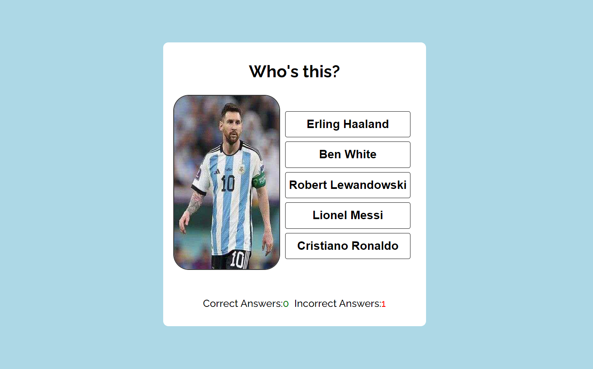
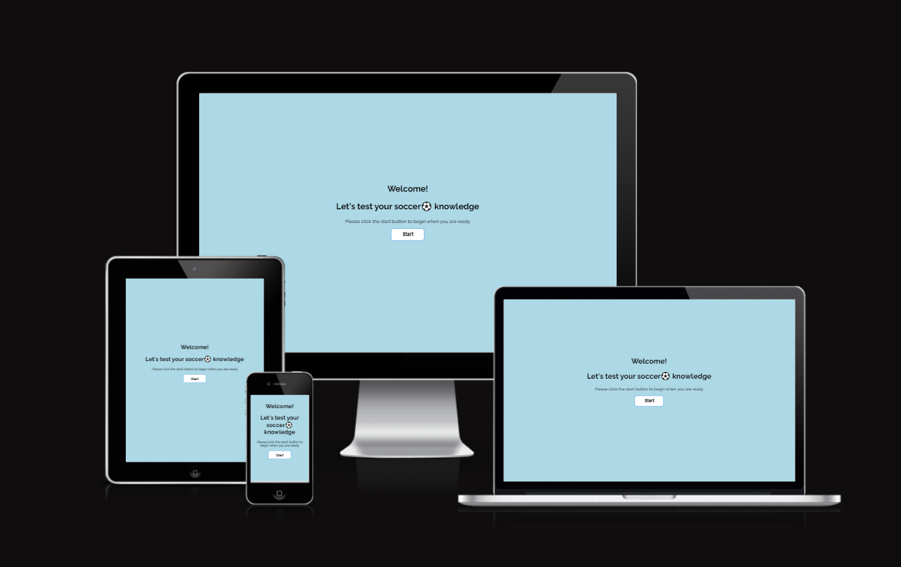

# Soccer⚽ Quiz Game

The Soccer Quiz Game is an online game app for football lovers irrespective of age. It aims at entertaining and testing soccer lovers' knowledge of the identity of some of the game's most decorated players.

## User

- As a user, i want to be able to find a soccer game online for entertainment purposes.
- As a user, i want to be able to test my knowledge of football players while also being entertained.
- As a user, i want to be able to know the right answer when i fail a question.
- As a user, i want to be able to access the game at any time of the day.

## Game Developer

- As the game developer, i want to be able to create a soccer quiz game every football lover can enjoy irrespective of age.
- As the game developer, i want to be able to welcome users to my game app and give them to opportunity to begin when they are ready.
- As the game developer, i want to be able to test football lovers' knowledge of some of their favorite players.
- As the game developer, i want to be able to provide players, answer options to select the right answer from.
- As the game developer, i want to be able to immediately notify players of their correctly and incorrectly picked answers.
- As the game developer, i want to be able to enable players instantly see their correct and incorrect game scores as they play.
- As the game developer, i want to be able to enable players reset and restart the game after 5 plays.

## Features

In achieving the user and app developer goals, i have created a two-paged picture/name pairing quiz game that requires players to identify a randomly generated player's image by name from five(5) provided name options while also using the feedback and scoring features to enhance users' experience. Upon visiting the app, users are greeted and invited to begin playing when they are ready via the welcome page. Upon clicking the start button, users are taken to the game page to begin playing.

### The Welcome Page

- This is the first page visitors of the app encounter. The page welcomes players to the app and informs them what the game is about.

### The Start Button

- A start button is provided on the welcome page that allows gives visitors access to the the game page to play the game.

### The Game Page

- This page contains the game itself. Visitors/players can play the game directly on this page.

### The Feedback Feature

- The feedback feature is otherwise identified also as the message feature. The idea behind including this feature is to notify players in real time of whether a selected answer is right or wrong.

- Where a selected answer is right, a green-colored - "Congrats! Answer is Correct." - alert pops up and where the selected answer is wrong, a red-colored - "Incorrect! The answer was ${correctAnswer}" - pops up.

- The Scoring Feature

- The idea behind including the scoring tracker feature is to keep track in real time of the number of players' won and lost plays. While the "correct" counter keeps track of number of correct answers scored by players, the "incorrect" counter tracks the number of players' wrong answers.

### The Restart Button

- A restart button is provided at the end of the game to enable users refresh the game and start a new game.

## Technology Used

**Html*

- I used this technology to structure my webpages.

**CSS*

- I used this technology to style and add layouts to my project.

**JavaScript*

- I used this technology to add interactivity to this project.

**GoogleFonts*

- I used this techology for all the fonts used in this project.

**Hubspot*

- I used this technology to create my favicon logo.

**jpeg-optimizer.com*

- I used this technology to optimize the images i used in this project.

## Testing

I manually tested this project to determine site usability, responsiveness and intuitivity to new users, by self and with the help of a few friends.

### Testing phase

#### Testing the start and option buttons

| Test | Outcome |
| ----------- | ----------- |
| Start button leads to the game page. | Pass |
| Option buttons increments correct and incorrect scores and also lead to the next question | Pass |

#### Testing for responsiveness

| Test | Outcome |
| ----------- | ----------- |
| Welcome and game pages display correctly on screens larger than 950px. | Pass |
| Welcome and game pages display correctly on screens smaller than 950px | Pass |

### User testing

#### User testing challenge

5 users were tasked prior to visiting the web page to conduct under-stated basic testing and report on success or otherwise.

| Test | Result |
| ----------- | ----------- |
| Upon arrival to website please click start button to see if it takes you to the game page | 100% |
| Upon arrival to the game page, please confirm the game loads | 100% |
| Please use the option buttons to select an answer and see if you will get a feedback of correct or incorrect answer | 100% |
| Please confirm if correct and incorrect answers increments accordingly in real time as you play | 100% |

#### User responsive testing

5 users were asked to view the app on their mobile devices and/or tablets to provide any feedback on errors or page overlapping issues.

| Test | Result |
| ----------- | ----------- |
| Issues reported | None |

## Bugs

### Solved bugs

- The game mostly shows same question multiple times because loadQuestion() randomly selects questions without tracking used ones. To fix this, I introduced and maintained an array of used question indices.

- The answer check was case-sensitive (this.innerText === correctAnswer), which may cause correct answers to be marked wrong. I fixed this by making comparison case-insensitive.

- Users can continue to click on answers during the transition between questions, which results in unintended score changes. This issue also occurs when the restart button appears at the end of the quiz, allowing users to manipulate scores by clicking repeatedly. To fix this, I disabled input during transitions and re-enable it when appropriate by adding an "isAnswering" flag and updating the checkAnswer() and runGame() functions.

- Scores might not reset correctly between games. To fix this, I updated the runGame() function and ensured proper score initializzation.

- The game has no error handling for missing images. To fix this, I added error handling for missing images while also creating a fallback image in event image upload fails.

- Variable naming inconsistency (camelCase and PascalCase) was fixed by consistently using camelCase for all variables.

- Unused variables including 'play', 'options', and 'scoreBoard' were deleted to clean up the code and avoid potential confusion or unintended behavior.

- I refactored the JavaScript code by moving the question data to an external `questions.json` file for better data management while also adding a function that fetches data from the file and ensures proper error handling during data retrieval.

- Upon moving the question data to an external `questions.json` file, the question data won't load on the game page as it kept outputting an 'Invalid question data at index: 0' error message and subsequently, a 'Failed to load questions. Status: 404' error message. To fix these bugs, I restructured the question data from 'image, options, answer' to 'image, answer, options', repositioned the file to the root directory and ensured to use the correct path ("questions.json") to fetch the file.

- I created answer buttons dynamically based on the options in each question. To achieve this, I removed the hardcoded option buttons from the HTML and created/appended buttons in JavaScript based on the number of options in the current question.

- Further more, I also refactored the README.md file using effective Markdown in the documentation and removing all HTML tags, to improve readability and structure, making it easier for others to understand and navigate through the project.

- I have also modified the index.html file with semantic HTML elements to enhance the code's readability and structure and improve accessibility for assistive technologies and search engine optimization.

- I fixed a content overflow visibility issue that persisted on mobile screens by changing overflow: hidden to overflow-y: auto, removing max-height constraints on .container, and ensuring body and main use flex in a way that allows vertical growth in the style.css file.

- I added an additional 'Player Feedback and Stats' feature to display final result and performanance at the end of each round of the game. The correctScore wasn't updating correctly resulting in inaccurate tallying of final result from each round of play. I fixed this bug by updating the the global correctScore variable directly in the incrementScore() and incrementWrongScore() functions.

### Unfixed Bugs

- No unfixed bugs

## Validator Testing

### HTML

- The W3C validator-detected errors were corrected.
- No errors were returned when re-ran on W3C validator after correction was effected.

### CSS

- No errors were returned when css style sheet was run on the official (Jigsaw) validator.

### Accessibility

- I confirmed that the colors and fonts chosen are easy to read and accessible by running it through lighhouse in devtools.

## Deployment

The site was deployed to GitHub pages using the following steps:

- Go to the settings tab of GitHub repository page
- On the left-hand sidebar in the code and automation section, select pages
- Set 'Source' to 'Deploy from Branch', select 'Main branch', set 'Folder' to 'Root', then click save
- Click the 'Code<>' tab and wait a few minutes and then refresh repository
- Go to the 'Environments' section on the right-hand side and click on 'github-pages'
- Click on the URL displayed to see the live deployed site.

The live link can be found here - [Soccer Quiz Game](https://sirjay009.github.io/Soccer-Quiz-Game/)

## Credits

- The favicon link code was taken from [w3schools](https://www.w3schools.com)

- The increment scores code was taken from the CI love Maths Project

- The scrollbar debug code was taken from [r3habmedia](https://www.youtube.com/c/r3habmedia)
Pieces of code for the general styling of the project was also taken from [w3schools](https://www.w3schools.com) , [Codedamn](https://www.codedamn.com) and [The Wheel Chair Guy](https://www.youtube.com/c/TheWheelchairGuy)

- I also utilized a plethora of online resources and tutorials including [Stackoverflow](https://stackoverflow.com/), [title](https://www.youtube.com/@WebDevSimplified), [Shecodes](https://www.shecodes.io/), [Geeks for Geeks](https://www.geeksforgeeks.org/),  to accomplish this project.
